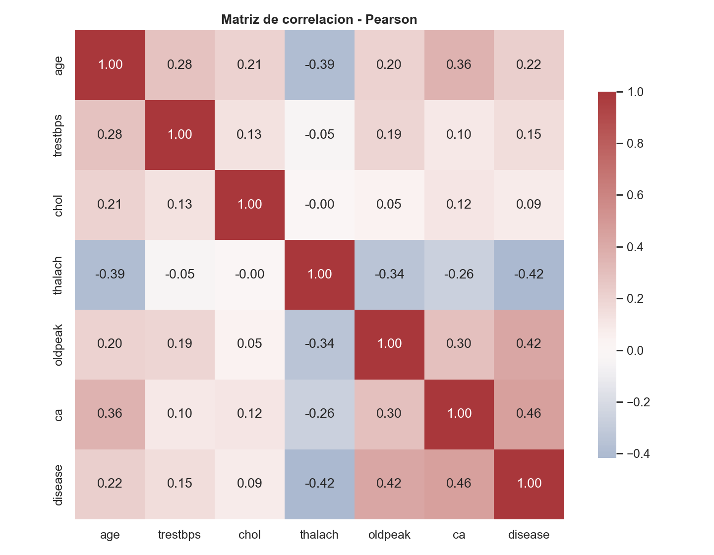
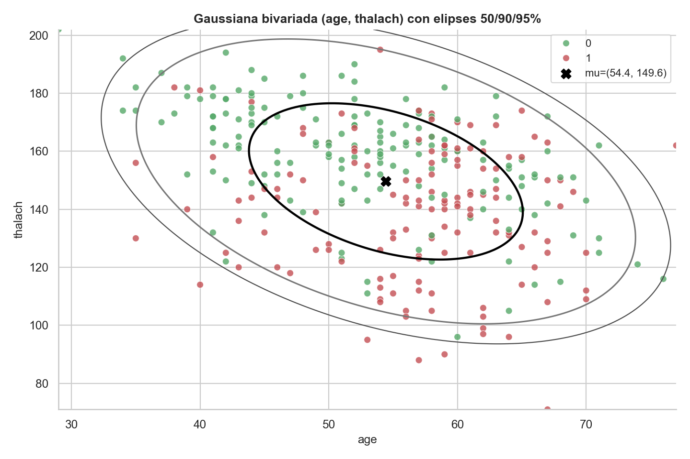
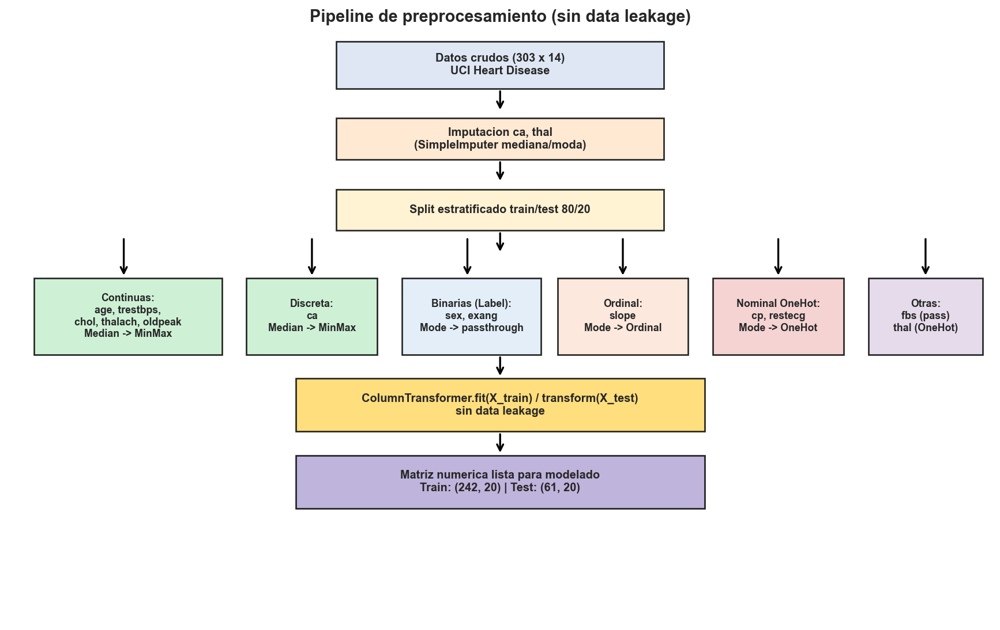
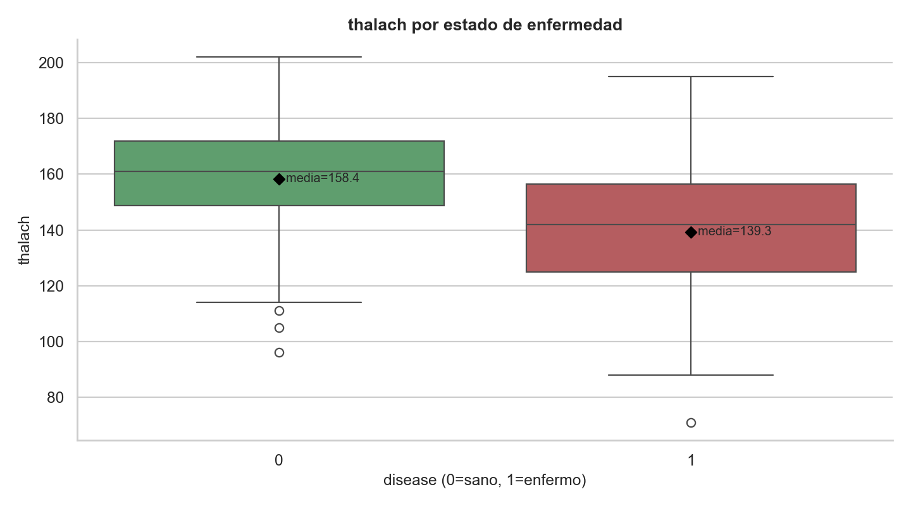

# Análisis estadístico y EDA — Heart Disease

Proyecto final de la materia **Estadística y Análisis Exploratorio de Datos**. Análisis estadístico completo del dataset **Heart Disease** (Cleveland Clinic Foundation — UCI Machine Learning Repository), con **303 pacientes** y 14 variables clínicas, para estudiar los factores asociados a la presencia de enfermedad cardíaca.

## Objetivo

Aplicar un flujo estadístico riguroso —desde el diagnóstico inicial de los datos hasta la inferencia y el preprocesamiento— para identificar qué variables clínicas se relacionan con el diagnóstico de enfermedad cardíaca y dejar los datos listos para modelado, **sin fuga de información (data leakage)**.

## Qué incluye

1. **Diagnóstico inicial:** estructura, duplicados y valores faltantes (`ca` y `thal`).
2. **Clasificación de variables** y diccionario estadístico.
3. **Estadística descriptiva** e interpretación clínica.
4. **Distribuciones univariadas y categóricas.**
5. **Análisis bivariado y correlaciones** (Pearson y Spearman).
6. **Ajuste MLE, pruebas de normalidad** (Kolmogórov–Smirnov, Shapiro–Wilk) y distribuciones no normales.
7. **Gaussiana multivariada**, distribución condicional y un clasificador **Bayes simple**.
8. **Inferencia estadística:** pruebas de hipótesis, intervalos de confianza, ANOVA y post-hoc de **Tukey**.
9. **Outliers** (Isolation Forest), **imputación** (KNN / Iterative), codificación y **pipeline de scikit-learn** con separación train/test.

## Tecnologías

`Python` · `pandas` · `NumPy` · `SciPy` · `statsmodels` · `scikit-learn` · `matplotlib`

## Hallazgos principales

- Las correlaciones más fuertes con el diagnóstico (`disease`) son el número de vasos coronarios afectados (`ca`, r ≈ 0.46) y otras variables hemodinámicas.
- Las variables `age`, `thalach` y `chol` **no siguen una distribución normal** (rechazo en KS y Shapiro al 5%).
- El pipeline final separa entrenamiento y prueba **antes** de imputar y escalar, evitando fuga de datos.

## Visualizaciones

| Correlaciones (Pearson) | Gaussiana bivariada |
|:---:|:---:|
|  |  |

| Pipeline de preprocesamiento | Frecuencia cardíaca vs. diagnóstico |
|:---:|:---:|
|  |  |

## Estructura

```
01-estadistica-heart-disease/
├── heart_disease_eda.ipynb          # Notebook con todo el análisis
├── Informe_Tecnico_Heart_Disease.pdf # Informe técnico
├── figuras/                          # 38 gráficas generadas
└── resultados/                       # Tablas de resultados (CSV, XLSX, JSON)
```

## Cómo ejecutar

```bash
pip install pandas numpy scipy statsmodels scikit-learn matplotlib
jupyter notebook heart_disease_eda.ipynb
```
